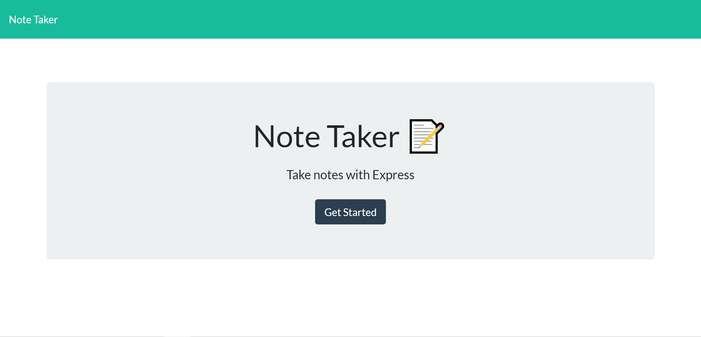
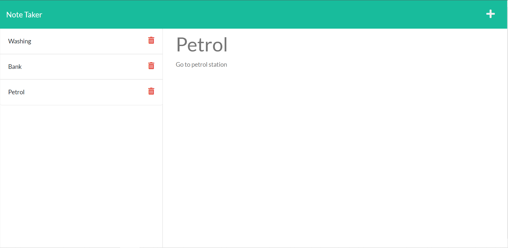

# Note Taker 

## Licencing
 
 
This licence is covered under the licence of None. 

## Table Of Contents
[licencing](#licencing) 

[description](#description) 

[Installation](#installation) 

[Usage](#usage) 

[Contributing](#contributing) 

[Questions](#questions) 

## Description
The purpose of this project is To allow a user to create notes, delete notes, and store them. This allows a user to have their notes accessible digitally to organise their day. 

## Installation
To correctly install this project install zip folder and extract. Run npm i in command line when in correct repository to install dependancies. 

## Usage
To use this project run node index.js in command line and click on the link produced or click on the heroku link below to access public app. Once in application, click get started button. From there type in title and text of not. Once completed click the save icon in the top right. To add another note click the plus icon in the top right. To delete, click the red trash can button next to each note on the left hand side of the application. To view a previous note, click on the title of the desired note. Link for heroku app: [View Here](https://note-taker-ethan.herokuapp.com/)  

## Contributing 
To contribute to this project contact me directly with desired changes via email 
 
## Questions 
Please find the link to my github profile below, along with my email address should a user or developer have any further questions 

https://github.com/ethangodley ethan.godley@hotmail.com
